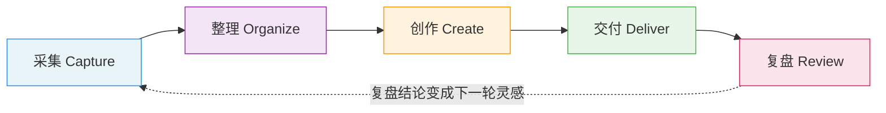

## OrbiGet Craft 创作方法论

> 这是一套关于「如何管理创作过程」的思想架构，来自 OrbiGet Craft 产品的内部设计文档。
>
> 我们选择把这些东西公开，是因为相信：**好的创作工具应该先讲清楚自己为什么存在，再让人决定要不要用。**

---

### 这里有什么

五份文档 + 两处代码，从宏观到具体：

| 文档 | 讲什么 | 适合谁看 |
|------|--------|----------|
| [五层创作模型](./docs/01-five-layers.md) | 创作的完整链路：采集→整理→创作→交付→复盘，每一层做什么、不做什么 | 所有创作者，想理解"创作过程管理"这个概念的人 |
| [跨项目联动的价值](./docs/02-multi-project-value.md) | 从「创作过程是资产」出发，推演资产为何要跨项目流动，以及它如何沉淀为个人 IP | 想理解"多项目联动"这个核心差异化的创作者 |
| [采集原则](./docs/03-collection-principles.md) | 什么数据值得保留、什么应该丢掉，采集的底线在哪里 | 做知识管理、素材管理的人，以及所有被"收藏了但从没看过"困扰的人 |
| [Agent 设计原则](./docs/04-agent-philosophy.md) | AI 在创作工具里应该做什么、不应该做什么 | 对 AI 产品边界、人机协作方式感兴趣的人 |
| [数据沉淀原则](./docs/05-data-settlement.md) | 记录如何变得可信、可带走：三层沉淀与只追加/链式自验证/快照自包含 | 关心「数据主权怎么落地」、数据可信与可携带的人 |
| [ai-client 透明代码](./code/ai-client/) | AI 连接层的通用协议代码（HTTP 层、OpenAI 兼容 / Ollama 适配器），开源供审计「数据发往哪里」 | 关心数据隐私、想验证「数据流向由你决定」承诺的技术用户 |
| [capture 透明代码](./code/capture/) | 网页采集的通用部分（DOM 元数据提取、正文抽取、文本清理、标题兜底），开源供审计「采集时读取了什么」 | 关心数据隐私、想验证"采集只在本地"承诺的技术用户 |

---

### 核心模型速览

五层创作模型是整套方法论的骨架：

每一层单独看，都有对应的工具。价值不在单层能力，而在**层与层之间的连接**——采集的素材进入项目、项目的素材进入创作、创作成果带着过程记录交付、交付记录成为复盘依据、复盘结论推动下一轮采集。

---

### 为什么开源这些

OrbiGet Craft 是一款浏览器里的创作管理工具。我们公开了两类内容，各有各的理由：

**方法论**——五层创作模型、项目优先原则、采集底线、Agent 边界，这些是从大量产品讨论与实践中沉淀下来的思考框架。它们不属于任何一个人，值得被更多人用起来：

- **对创作者有用**：即使你不用 Craft，这套框架也能帮你审视自己现在的创作流程缺了哪一环。
- **对工具设计者有参考**：如果你也在做创作类工具，这些文档展示了我们做每个设计决策时的思考过程。

**代码（可审计）**——Craft 的两条核心承诺都建立在「数据流向由你决定」上，而这两条承诺恰恰是最需要被验证的：

- **AI 连接层**（[code/ai-client](./code/ai-client/)）：请求只发往你自己配置的服务商。公开协议代码，让「数据发往哪里」可以逐行核对，而不是一句口号。
- **网页采集层**（[code/capture](./code/capture/)）：采集只在你主动操作时读取当前页面、只保留创作相关字段。公开采集代码，让「采集了什么」可以被审阅。

---

### 核心主张

> **OrbiGet Craft 不是让用户收集更多东西，而是让每一次收集都能进入项目、形成轨迹、产出成果，并在复盘中推动下一次创作。**

创作过程本身就是资产。灵感碎片、随手记、半成品、修改痕迹、交付记录——这些都值得被管理，而不是只保留最终成品。

---

### 关于 OrbiGet Craft

- 产品形态：Chrome 扩展，住在浏览器里
- 数据存储：本地优先（IndexedDB + 用户授权的工作区文件夹），数据主权在你——流向由你决定
- 核心能力：网页素材采集、项目驱动管理、AI 辅助复盘、日志链可验证
- 产品官网：[orbiget.com](https://orbiget.com)

---

### 许可协议

- 本文档与站点内容采用 [CC BY-SA 4.0](https://creativecommons.org/licenses/by-sa/4.0/) 许可协议发布。
  你可以自由分享和改编，但需要：
  - **署名**：注明来自 OrbiGet Craft
  - **相同方式共享**：改编后的内容使用相同协议发布
- `code/ai-client/` 代码源自 OrbiGet Craft 主项目，采用其 [AFL v3.0](./code/ai-client/LICENSE) 许可。

---

### 反馈与讨论

这是一个「思想 + 证据」仓库：文档用于公开讨论，`code/` 代码用于审计验证。欢迎通过 Issues 提问与讨论；暂不接受 Pull Request。

如果你对某篇文档有疑问、想讨论、或者发现了逻辑漏洞，欢迎通过以下方式联系：

- GitHub Issues：提问和讨论
- 产品内反馈：OrbiGet Craft 工作台右上角反馈按钮

---

*文档版本：2026-07 · 随产品演进持续更新*
